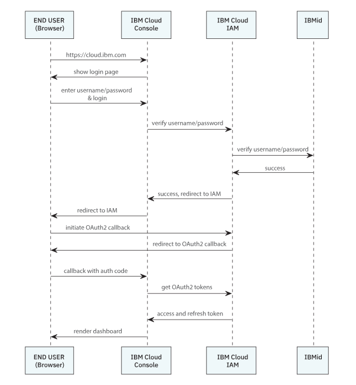
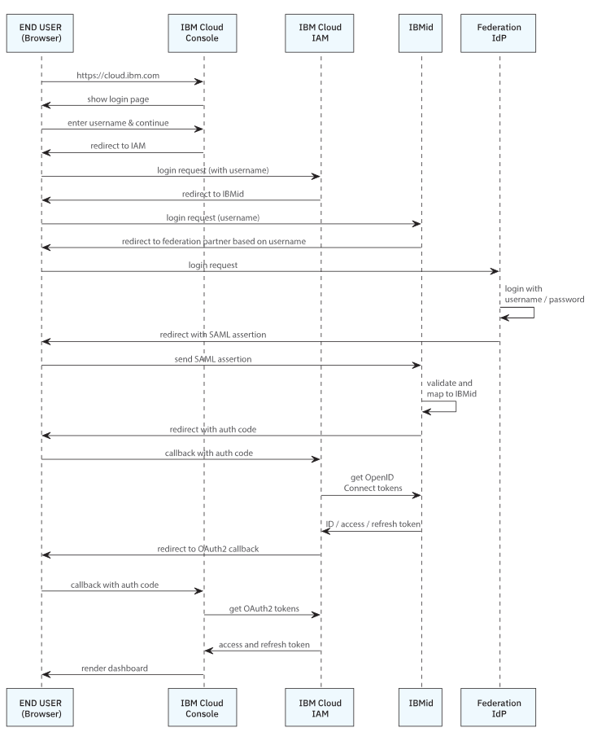

---

copyright:

  years: 2020, 2021

lastupdated: "2021-11-29"

keywords: login, how login works, login flow, login diagram, login sequence

subcollection: account

---

{{site.data.keyword.attribute-definition-list}}

# {{site.data.keyword.Bluemix_notm}} login sequences
{: #login-sequence}

Review the following login sequence flows to understand the details about how federated, non-federated, and users added through {{site.data.keyword.appid_full_notm}} with a SAML provider connected to {{site.data.keyword.cloud}} Identity and Access Management (IAM) log in to {{site.data.keyword.cloud_notm}}.
{: shortdesc}

## Login sequence for non-federated users with an IBMid
{: #non-fed-ibmid-login}

The standard login sequence for users in {{site.data.keyword.cloud_notm}} that are not federated works according to the following sequence:

{: caption="Figure 1. Login process for non-federated users with an IBMid" caption-side="bottom"}

1. The user starts by visiting the URL https://cloud.ibm.com with a browser. The {{site.data.keyword.cloud_notm}} console  sends back a login page to the browser.
2. On the login page, the user enters their username, clicks Continue, then enters their password and sends this information to the console by clicking Log in.
3. The username and password combination is forwarded by the console to the IAM component of {{site.data.keyword.cloud_notm}}.
4. IAM uses the IBMid system to validate if the username and password combination is correct.
5. After successful validation, IAM responds to the console with a success response and provides a URL that the console should send to the user's browser, so that the user can finish the login sequence.
6. The browser consumes the redirect instruction and navigates to IAM to allow {{site.data.keyword.cloud_notm}} to finish the login sequence. This browser redirect is necessary to set necessary single-sign-on cookies on the user's browser that prevents the user from entering the login credentials again.
7. IAM then finishes its authentication flow with the console by sending an OAuth2 compliant redirect with an authorization code to the browser.
8. The browser provides the authorization code to the console, which in turn is used to retrieve the required tokens from IAM.
9. When the console receives the tokens, the login sequence ends. The console can now invoke {{site.data.keyword.cloud_notm}} APIs and identify the user.
10. The console displays the dashboard with user-specific content.

## Login sequence for federated users with an IBMid
{: #fed-ibmid-login}

IBMid allows enterprise customers to federate their user authentication and authorization system with IBMid. This way, users don't need to manage another user ID. Instead, they are able to log in into {{site.data.keyword.cloud_notm}} using their well-known customer-managed user ID. The login sequence for federated users in {{site.data.keyword.cloud_notm}} works according to the following sequence:

{: caption="Figure 2. Login process for federated users with an IBMid" caption-side="bottom"}

1. The user starts by visiting the URL https://cloud.ibm.com with a browser. The {{site.data.keyword.cloud_notm}} console sends back a login page to the browser.
2. On the login page, the user enters their username.
3. After clicking to continue, the {{site.data.keyword.cloud_notm}} console redirects the user's browser to {{site.data.keyword.cloud_notm}}'s IAM component. As part of the redirect, the already entered username is transmitted.
4. With the help of the username, IAM is able to determine the identity provider (IdP) that should be used to run the login sequence. Therefore, IAM is sending back a redirect request to the user's browser.
5. The browser is completing the redirect and displays the enterprise customer's login page. For this interaction, a SAML request is sent to the enterprise customer's user authentication and authorization system.
6. After validating the user's credentials, the enterprise customer's system sends a redirect instruction to the user's browser. Part of this redirect is the SAML response containing assertions that describe the user and the additional attributes of that user.
7. The browser completes the redirect and sends the SAML response with assertions to IBMid.
8. IBMid validates the SAML response and maps the user to an IBMid.
9. IBMid sends a redirect to the user's browser with an authorization code to continue the authentication flow according to the OpenID Connect standard.
10. The browser contacts IAM and provides the authorization code, so that IAM can retrieve the required tokens from IBMid using the OpenID Connect standard.
11. After IBMid provides the required tokens, IAM is now finishing its authentication flow with the console by sending an OAuth2 compliant redirect with an authorization code to the browser.
12. The browser provides the authorization code to the console, which in turn is used to retrieve the required tokens from IAM.
13. When the console receives the tokens, the login sequence ends. The console can now invoke {{site.data.keyword.cloud_notm}} APIs and identify the user.
14. The console displays the dashboard with user-specific content.

## Login sequence for {{site.data.keyword.appid_short}} with a connected SAML partner
{: #appid-saml-login}

If you choose to integrate with your external IdP to securely authenticate external users to your account by using an {{site.data.keyword.appid_short}} instance, the login sequence works according to the following sequence. For more information about this type of authentication, see [Enabling authentication from an external identity provider](/docs/account?topic=account-idp-integration).

{: caption="Figure 3. Login process for users who areconnected from an App ID instance connected with a SAML partner" caption-side="bottom"}

1. The user starts the sequence by visiting an account-specific URL with their browser. This is either `https://cloud.ibm.com/authorize/<account id>` or `https://cloud.ibm.com/authorize/<account alias>`. The account alias can be configured on the IAM Identity Provider configuration pages in the {{site.data.keyword.cloud_notm}} console.

Using a specific URL is required to address the correct federated SAML partner.
{: note}

2. The {{site.data.keyword.cloud_notm}} console (console) redirects the user's browser to {{site.data.keyword.cloud_notm}}'s IAM component. As part of the redirect, the account ID or alias is sent to IAM.
3. With the help of the account ID or alias, IAM determines the {{site.data.keyword.appid_short}} instance that is needed to run the login sequence. Therefore, IAM sends back a redirect request to the user's browser.
4. The browser completes the redirect and ends on an {{site.data.keyword.appid_short}} provided page. This page immediately returns a redirect to the browser containing a SAML request.
5. The SAML request is sent to the enterprise customer's user authentication and authorization system.
6. After validating the user's credentials, the enterprise customer's system sends a redirect instruction to the user's browser. Part of this redirect is the SAML response containing assertions that describe the user and the additional attributes of that user.
7. The browser completes the redirect and sends the SAML response with assertions to the {{site.data.keyword.appid_short}} instance.
8. After validating the SAML response, {{site.data.keyword.appid_short}} now sends a redirect to the browser that contains an authorization code to continue the authentication flow according to the OpenID Connect standard.
9. The browser contacts IAM and provides the authorization code so that IAM can retrieve the required tokens from {{site.data.keyword.appid_short}} using the OpenID Connect standard.
10. After {{site.data.keyword.appid_short}} has provided the required tokens, IAM is now finishing its authentication flow with the console by sending an OAuth2 compliant redirect with an authorization code to the browser.
11. The browser provides the authorization code to the console, which in turn is used to retrieve the required tokens from IAM.
12. When the console receives the tokens, the login sequence ends. The console can now invoke {{site.data.keyword.cloud_notm}} APIs and identify the user.
13. The console displays the dashboard with user-specific content.
